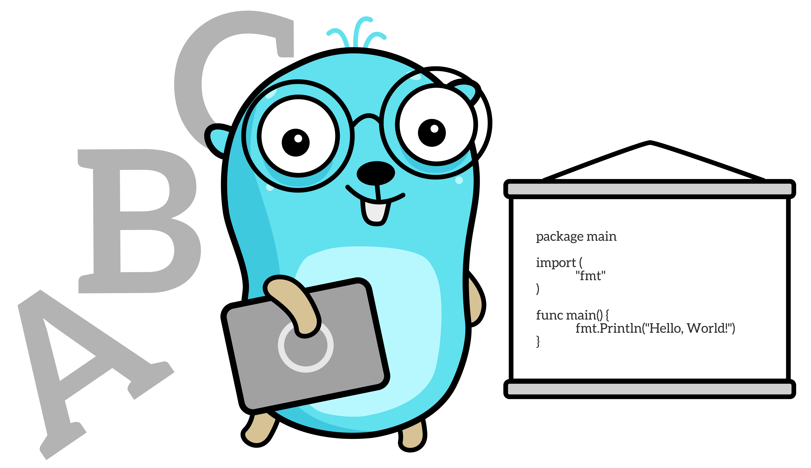
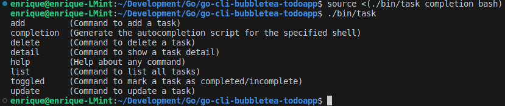
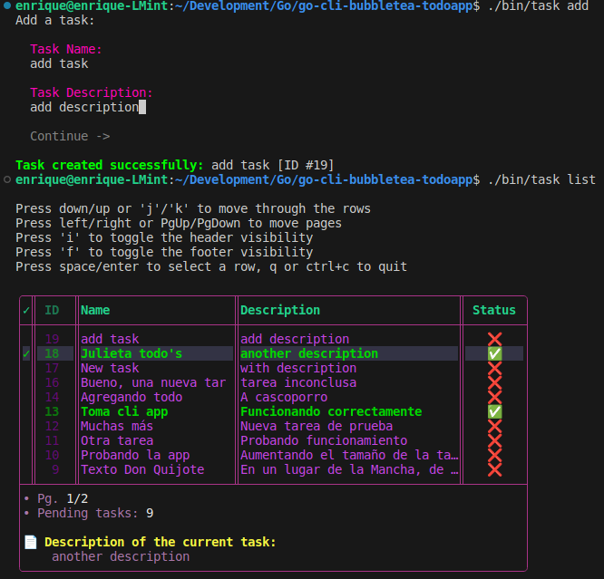
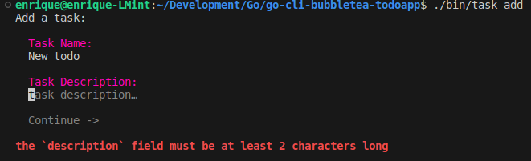
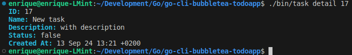
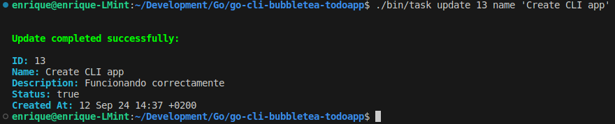
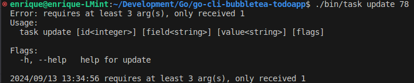

<div align="center">

# Command line application (CLI Todo App) made with Bubble Tea (to create a TUI) & Cobra frameworks, and CRUD to a SQLite database



<br />

 

</div>

<hr />

### Features 🚀

- [x] **Using [GORM](https://gorm.io/) for agile database management:** The database used is SQLite3 and its (hidden) storage file is created in the user folder.
- [x] **Using [Cobra](https://github.com/spf13/cobra) framework:** A library for creating powerful modern CLI applications. `Cobra` provides its own [program](https://github.com/spf13/cobra-cli) that will create your application and add any commands you want. It's the easiest way to incorporate `Cobra` into your application. If you prefer to use this option to create CLI apps with `Cobra`, install it with the command: `go install github.com/spf13/cobra-cli@latest`.
- [x] **Using the [Bubble Tea](https://github.com/charmbracelet/bubbletea) framework:** The functional and stateful way to build terminal apps. A Go framework based on [The Elm Architecture](https://guide.elm-lang.org/architecture/). `Bubble Tea` is well-suited for simple and complex terminal applications, either inline, full-window, or a mix of both.
- [x] **Using the [Lip Gloss](https://github.com/charmbracelet/lipgloss) library:** From the same creators of the Bubble Tea framework. It allows you to style the TUI (text-based user interface) in a similar way to how it is done with CSS, allowing you to easily create layouts.

---

### 🖼️ Screenshots:

<div align="center">

###### Terminal showing how to achieve autocompletion in the current session and the resulting list of commands:



<br>

###### Terminal showing successful task creation and list of tasks in table form:



<br>

###### Terminal showing the task creation form indicating a warning & the details of a specific task given its ID:

&nbsp;&nbsp;

<br>

###### Terminal showing the update of the fields of a task given its ID & the error output of the application when the user does not enter the correct arguments:

&nbsp;&nbsp;

<br>

</div>

---

### 👨‍🚀 Getting Started:

#### Installing the application

If you want to install the application on your machine and you have Go installed, you can simply run the following command (requires Go 1.23 or higher):

```
$ go install -ldflags="-s -w" github.com/emarifer/go-cli-bubbletea-todoapp/cmd/task@1.0.1
```

This will download the source code (and any necessary dependencies) and compile it into an executable that will be placed in the PATH you've set for Golang binaries.


If you don't have Go, you can download the appropriate executable for your system from [here](https://github.com/emarifer/go-cli-bubbletea-todoapp/releases). Once unzipped, you can place it in the folder where your system normally stores executables (although you could place it in any directory). Then, you just have to update the system PATH with that address.

#### Building the app yourself (Go 1.23 or higher required)

- Clone the repository and run the following commands:

```
$ go mod tidy && go run ./cmd/task -h # to start the application in development mode
```

- Build for production:

```
$ go build -ldflags="-s -w" -o ./bin/task ./cmd/task # ./bin/task -h to run the application
```

In the latter case, you can call the `task` command by placing the executable you generated in the appropriate directory on your system and proceeding as above.

---

### Happy coding 😀!!